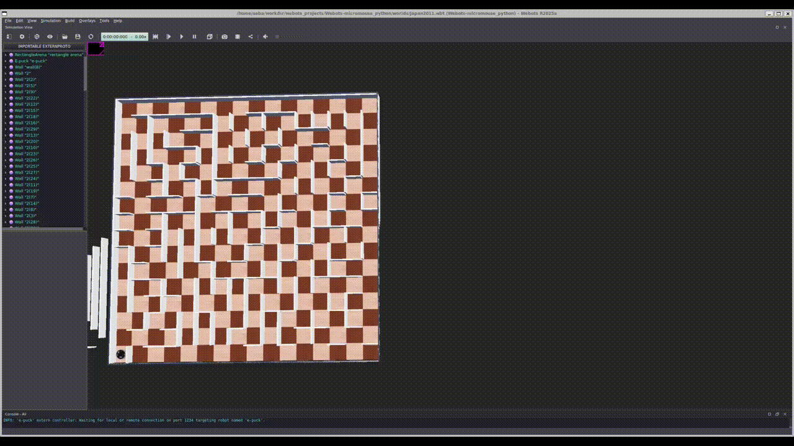
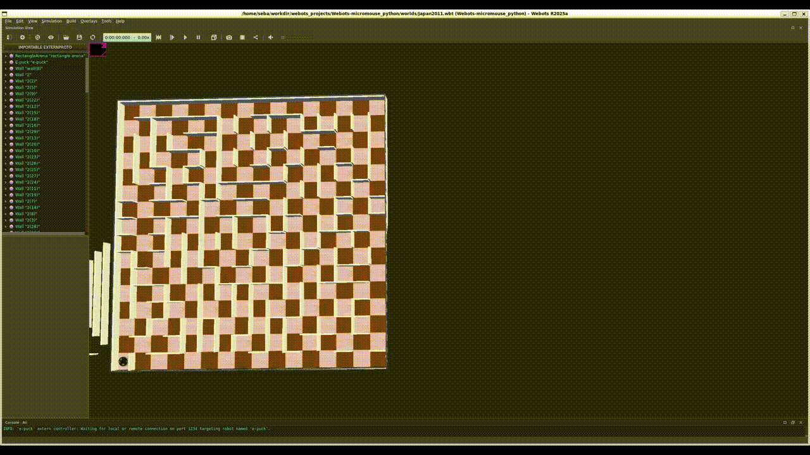

# Webots maze solver AKA MicroMouse

This project was originally created as part of a diploma thesis, whose goal was to compare a few path planning algorithms with the use of a mobile robot in a simulated environment. The principle of operation of the program is based on MicroMouse competition, so it can serve as a platform/base for testing other control algorithms for MicroMouse or to learn about those already implemented.


## Table of Contents

- [Features](#features)
- [Implemented algorithms](#implemented-algorithms)
- [How to run](#how-to-run)
- [Configuration](#configuration)
- [Code structure](#code-structure)
- [License](#license)

## Features

- Simulation made in Webots application which contains 10 worlds with 10 mazes which were used in MicroMouse competitions in a past.
All mazes have start field in left down corner and goal fields in centre. Horizontal dimension of one field is 120 x 120 mm (not 180 x 180 which is a standard MicroMouse). That's because mobile robot Epuck2 was used and its IR distance sensors don't have enough range of operation.
- Robot controller is written in Python and implements following algorithms: Floodfill, BFS (Breadth first search), DFS (Deep first search), A*. 
From the config.yaml file we can choose which algorithm, maze layout, and operation mode to use in the next run.
- Visualization of algorithm operation progress by drawing a searched maze and values related to the algorithms operation.





## Implemented algorithms

- **Floodfill**: Every cycle, the robot calculates the shortest path to the target and attempts to follow it. When the target is reached, it checks if the path is the shortest by comparing it to the path in a maze where unvisited cells are assumed to have four walls. If the paths match in length, the shortest path is confirmed. Otherwise, the robot performs a second run from the target back to the start to explore unvisited areas. This process repeats until the shortest path is found.
- **Depth-first search (DFS)**: Does not guarantee the shortest path but usually finds a path very quickly in MicroMouse mazes.
- **Breadth-first search (BFS) modified**: Adjusted for robot movement. BFS searches horizontally through the graph by levels of nodes. To avoid unnecessary backtracking, only forks are treated as levels, meaning the robot only backtracks when reaching a new fork or dead-end. As a result, it does not guarantee the shortest path like the unmodified version.
- **A***: Guarantees the shortest path but has a very long search time.
- **A* modified**: A modification similar to BFS where the robot chooses its path in two ways:
  - If the current position is a fork or dead-end, choose the cell with the lowest F-cost and/or H-cost (just like standard A*).
  - If the current cell is a corridor, keep going until reaching a fork or dead-end. This approach makes searching much faster than the standard A* algorithm, as the robot does not need to traverse the entire maze just to check one cell. The only drawback is that it might not guarantee the shortest path, although in MicroMouse mazes it usually finds it.

## How to run

Before anything, download and install Webots simulator in version R2023a (newer versions also should work) and Python3 on your PC. Optionally use an IDE of your choice.
1. Configure Webots
  
    a) Without an IDE 
    1. Open one of the worlds .wbt file from the project.
    2. Change controller of e-puck robot in Webots project from extern to *Maze_solver_py*. For each world this operation must be done separately. **Webots controller module won’t be recognized and syntax suggestions won’t work in external editor.** 
    
    b) With an IDE (e.g., VS Code)
    1. Open a Webots/lib/controller folder in your IDE and create *setup.py* file (you may need to run your IDE as admin).
    2. Paste the following code into file:
    ```python
    from setuptools import setup

    setup(name='webots', version='1.0', packages=['controller', 'vehicle'])
    ```
    3. Run the following command in the terminal: *python setup.py sdist* . It will create a source distribution for Python package in dist folder.
    4. Run the following command to install the Webots package:
       ```bash
       # On Windows
       pip install webots --no-index --find-links "file://C:\path\to\dist"
       
       # On Linux
       pip install webots --no-index --find-links "file:///path/to/dist"
       ```
       If there is an error about the wrong version of *setuptools*, omit the *--no-index* flag in the command to allow pip to search for the package outside of the local directory.
    5. Go back to the project. A controller module now should be recognized by the editor.
2. Open terminal in Maze_solver_py directory. Go to Webots simulation and run it, then run *main.py*. A simulation should execute and a window with maze drawing should pop up.
3. During searching or speedrun, information about the process is logged in the terminal. After completing a course, the run time is printed and a prompt to press any key to end the program appears.
## Configuration

The project uses YAML configuration files `config.yaml` and `logging.yaml` located in the `controllers/Maze_solver_py/` directory to set simulation and logging parameters without modifying the code.

Here is an example of the `config.yaml` file:

```yaml
simulation:
  mode: SEARCH          # Python enum
  algorithm: FLOODFILL  # Python enum
  maze_layout: JAPAN_2011  # Python enum
  time_step: 64

robot:
  model: epuck
  axle: 0.0568
  wheel: 0.02002
  speed: 4

maze:
  rows: 16
  columns: 16
  start_position: 0
  target_position: 136
  tile_length: 0.12
  visited_flag: 64
```

Key settings:

- **simulation.mode**: Choose the operation mode - `SEARCH` for maze exploration and path finding, or `SPEEDRUN` for running the pre-computed path.
- **simulation.algorithm**: Select the algorithm to use, e.g., `FLOODFILL`, `BFS`, `DFS`, `A_STAR`, `A_STAR_MOD`.
- **simulation.maze_layout**: Choose the maze layout, e.g., `JAPAN_2011`, `UK2016`, etc.
- **simulation.time_step**: Time step for the simulation (in milliseconds).
- **robot.model**: Robot model, currently `epuck`.
- Other robot and maze parameters can be adjusted as needed.

Logging configuration (`logging.yaml`):

- **algorithm logger (`algorithm`)**: Logs algorithm flow, decisions, and intermediate values.
- **robot logger (`robot`)**: Logs robot movement, control, and sensor-related runtime events.
- **root logger (`root`)**: Logs general application messages not tied to a specific module.

Logger levels are independent, so you can filter debug output per module:

- To debug only robot behavior: set `robot` to `DEBUG` and `algorithm` to `INFO`.
- To debug only algorithm behavior: set `algorithm` to `DEBUG` and `robot` to `INFO`.
- To debug both modules: set both `robot` and `algorithm` to `DEBUG`.

Edit `config.yaml` to change simulation settings and `logging.yaml` to adjust logging behavior before running the simulation.

## Code structure

The controller code is organized into modules for better maintainability and navigation.

- **main.py**: The entry point of the application. It loads the configuration from `config.yaml`, initializes the `MazeSolver` class, and runs the robot simulation.
- **config/**: Contains configuration-related modules.
  - **loader.py**: Loads and parses the `config.yaml` file.
  - **logging_config.py**: Loads and applies logging settings from `logging.yaml`.
  - **models.py**: Defines data models for configuration using Pydantic.
  - **enums.py**: Defines enumerations for modes, algorithms, and maze layouts.
- **algorithm/**: Implements various pathfinding algorithms.
  - **algorithm_interface.py**: Defines the interface for algorithms.
  - **algorithm_base.py**: Base class for algorithms.
  - Specific algorithm files like `algorithm_floodfill.py`, `algorithm_bfs.py`, `algorithm_dfs.py`, `algorithm_a_star.py`, `algorithm_a_star_mod.py`, etc.
- **robot/**: Handles robot control.
  - **robot_interface.py**: Defines the robot interface.
  - **robot_base.py**: Base robot class.
  - **robot_epuck.py**: Implementation for the e-puck robot.
- **draw/**: Visualization module built with PySide6.
  - **qt_maze_drawer.py**: Main Qt-based maze visualization window and rendering logic.
  - **solver_worker.py**: Background worker thread that runs solver steps and emits draw updates to UI.
  - **common.py**: Shared drawing helpers and data formatting utilities for the Qt UI.
- **read_files/**: Data storage.
  - **storage.py**: Saves simulation results to files.
- **utils/**: Utility modules.
  - **types.py**: Contains shared dataclasses and types used across modules.
- **mazes_layouts.py**: Defines maze layouts and their representations.
- **tests/**: Contains unit tests for the algorithms and common functions.
- **config.yaml**: Configuration file (see Configuration section).
- **logging.yaml**: Logging configuration file used by the logging module.
